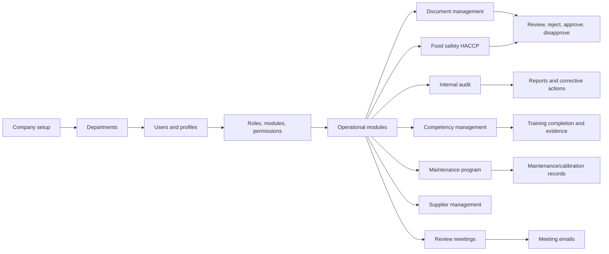

# Food Safety Quality Backend Specs

This folder documents the current backend implementation in `src`. The project is a NestJS API backed by MongoDB through Mongoose, with global JWT authentication, module access checks, endpoint permission checks, Swagger at `/api`, Cloudinary uploads, PDF watermark/cover-page generation in several workflows, and email notifications.

## Spec Index

- [Architecture](./architecture.md): module map, runtime flow, data boundaries, and integration points.
- [Permission Logic Implementation](./permission-logic-implementation.md): authentication, module access, endpoint permissions, roles, derived modules, and guard sequence.
- [Sequence Diagrams](./sequence-diagram.md): end-to-end flows for login, authorization, approvals, document control, HACCP, audits, maintenance, training, and meetings.
- [Use Cases](./use-cases.md): business use cases grouped by module.
- [Admin Management](./admin-management.md): companies, departments, users, profiles, login, suspension, role assignment.
- [RBAC And Auth](./rbac-auth.md): master modules, permissions, roles, derived modules, access resolution.
- [Document Management](./document-management.md): documents, uploaded documents, change requests, forms, form records.
- [Food Safety](./food-safety.md): products, HACCP team, process flow, food safety plans, decision trees, conducted HACCP.
- [Internal Audit](./internal-audit.md): auditors, process owners, audit plans, checklists, conducted audits, reports, corrective actions.
- [Competency Management](./competency-management.md): employees, trainers, trainings, yearly/monthly training plans, personal requisitions.
- [Maintenance Program](./maintenance-program.md): machinery, equipment, calibration, preventive maintenance, work requests.
- [Supplier Management](./supplier-management.md): supplier registration and approval lifecycle.
- [Review Meetings](./review-meetings.md): meeting participants, notifications, management review meeting records.
- [Integrations](./integrations.md): email, Cloudinary, files, Swagger, and supporting scripts.

## High-Level Business Flow

## Common Pattern Used By Most Modules

Most business modules follow this pattern:

1. Controller exposes REST endpoints.
2. `@SecuredEndpoint(moduleKey, permissionKey)` declares module and endpoint permission metadata.
3. Global guards authenticate the request and enforce module/permission access.
4. Service validates business state, reads/writes Mongoose models, and returns `{ status, message, data }` style payloads.
5. Approval-capable records move through `Pending`, `Reviewed`, `Rejected`, `Approved`, or `Disapproved` depending on the module.

