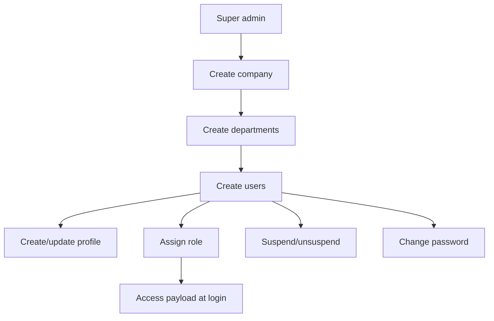
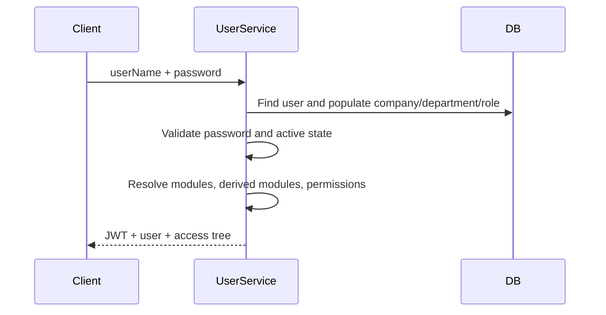

# Admin Management

Admin Management owns tenant setup, departments, users, login, profiles, suspension, password changes, and access reassignment.

## Flow



## Company

Purpose: create and maintain tenant companies.

Routes:

| Method | Path | Purpose |
| --- | --- | --- |
| `POST` | `/companies` | Create company. |
| `GET` | `/companies/all` | List companies. |
| `GET` | `/companies/:companyId` | Read company details. |
| `PATCH` | `/companies/:companyId` | Update company. |
| `DELETE` | `/companies/:companyId` | Delete company. |

Data owned: company name, unique company code, contact fields, address/logo-style metadata, active status, creator.

Important behavior:

- Users cannot log in when their company is inactive.
- Company ID is the top tenant boundary for company admins and related departments.

## Department

Purpose: create company departments and group operational records.

Routes:

| Method | Path | Purpose |
| --- | --- | --- |
| `POST` | `/departments` | Create department. |
| `GET` | `/departments` | List departments available to the actor. |
| `GET` | `/departments/:companyId` | List departments for a company. |
| `GET` | `/departments/:id` | Read department. |
| `PATCH` | `/departments` | Update department. |
| `DELETE` | `/departments/:departmentId` | Delete department. |

Data owned: company reference, department name/code, status, description.

## Users And Login

Purpose: manage application identities and access.

Public/auth entry routes:

| Method | Path | Purpose |
| --- | --- | --- |
| `POST` | `/users/super-admin` | Bootstrap a super-admin user. |
| `POST` | `/users/login` | Authenticate and return token/access payload. |

Protected routes:

| Method | Path | Purpose |
| --- | --- | --- |
| `POST` | `/users` | Create user. |
| `GET` | `/users` | List users. |
| `GET` | `/users/:id` | Read user. |
| `PUT` | `/users/:id` | Update user. |
| `DELETE` | `/users/:id` | Delete user. |
| `GET` | `/users/company/:companyId` | Users by company. |
| `GET` | `/users/company/:companyId/department/:departmentId` | Users by company and department. |
| `GET` | `/users/department/:departmentId` | Users by department. |
| `GET` | `/users/department/:departmentId/summary` | Department user summary. |
| `PATCH` | `/users/:id/assign-role` | Assign role. |
| `PATCH` | `/users/:id/suspend` | Suspend or unsuspend user. |
| `PATCH` | `/users/:id/change-password` | Change password. |
| `PATCH` | `/users/:id/reassign-access` | Recompute user access. |

Data owned: company, department, name, email, username, password, role, role type, suspension flag.

## Profile

Purpose: store extended identity metadata for a user.

The profile service currently supports lookup by user and profile creation for user-linked domain records. Profiles store identity details, skill/experience arrays, documents, and user linkage.

## Login Response Flow



## Frontend Login Contract

The frontend login screen calls `POST /users/login` with `userName` and `password`. The backend returns the session payload at the top level, not inside `data`.

Expected response shape:

```json
{
  "status": true,
  "message": "User Logged In successfully",
  "_id": "user id",
  "userName": "login name",
  "email": "user email",
  "roleType": "super-staff or company-user style value",
  "companyId": {
    "_id": "company id",
    "companyName": "Company name",
    "status": "active"
  },
  "departmentId": {
    "_id": "department id",
    "departmentName": "Department name"
  },
  "roleId": {
    "_id": "role id",
    "name": "Role name"
  },
  "access": {
    "modules": [
      {
        "_id": "module id",
        "key": "ADMIN_MANAGEMENT",
        "name": "Admin Management",
        "subTabs": [
          {
            "resource": "users",
            "permissions": [
              {
                "key": "EP_GET_USERS",
                "action": "read",
                "path": "/users"
              }
            ]
          }
        ]
      }
    ]
  },
  "Token": "jwt"
}
```

Frontend requirements:

- Store `Token` as the bearer token for protected API calls.
- Store the sanitized user and `access.modules` for navigation and screen-level permission checks.
- Treat missing/expired token, inactive company, suspended user, or inactive role responses as logout events.
- Route users to `/signin` when no token is present.
