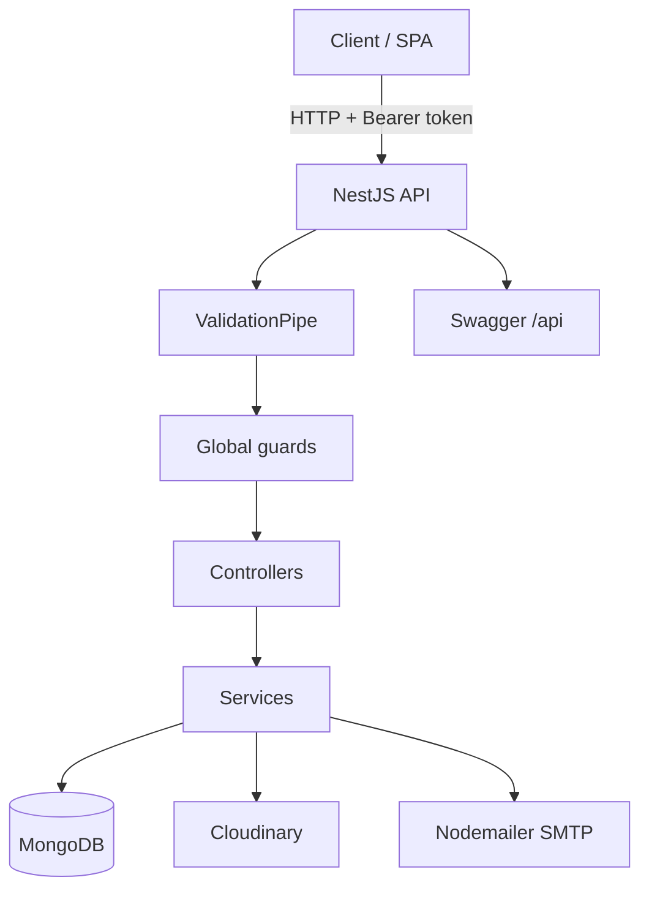
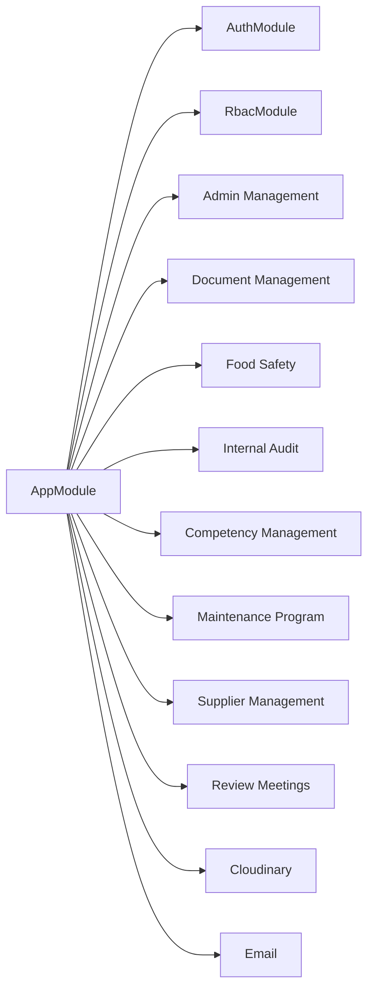
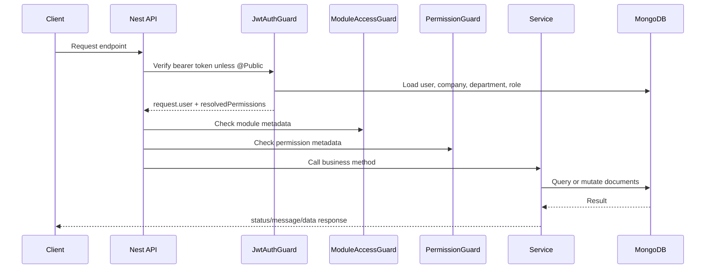

# Architecture

## Runtime Stack

- Framework: NestJS 11.
- Database: MongoDB through `@nestjs/mongoose`.
- Authentication: Bearer JWT verified with `JWT_CODE`.
- Authorization: global `JwtAuthGuard`, `ModuleAccessGuard`, and `PermissionGuard`.
- Validation: global `ValidationPipe` with `transform`, `whitelist`, and implicit conversion.
- API docs: Swagger at `/api`.
- External services: Cloudinary for file storage, Nodemailer/EJS for email templates.

## Module Map

## Domain Modules

| Domain | Modules |
| --- | --- |
| Admin Management | Company, Department, User, Profile |
| RBAC/Auth | Auth guards/decorators, Affiliation, RBAC, Derived modules |
| Document Management | Document, Upload Documents, Change Request, List Of Forms, Form Records |
| Food Safety | Product, HACCP Team, Processes, Food Safety Plan, Decision Tree, Conduct HACCP |
| Internal Audit | Process Owner, Internal Auditor, Yearly/Monthly Audit Plan, Checklist, Conduct Audits, Reports, Corrective Action |
| Competency Management | Employee, Trainer, Training, Yearly Training Plan, Monthly Training Plan, Personal Requisition |
| Maintenance Program | Machinery, Equipment, Calibration Record, Preventive Maintenance, Work Request |
| Supplier Management | Supplier |
| Review Meetings | Meeting Participants, Notification, MRM |

## Request Flow

## Data Boundary Conventions

- Tenant context is usually enforced through `companyId` and/or `departmentId`.
- Many operational documents are department-scoped.
- Users belong to a company and often a department.
- Role access is resolved from direct master modules and company-specific derived modules.
- Approval records usually store creator/updater/reviewer/approver/disapprover names or IDs plus dates.

## Important Cross-Module Dependencies

- User creation creates a `User` and often a companion `Profile`.
- Supplier, trainer, employee, meeting participant, auditor, and process owner workflows use profile-like identity details or create user/profile records.
- Document Management, Food Safety, and Internal Audit share approval-state concepts.
- Internal Audit reports depend on conducted audits, and corrective actions depend on reports.
- Review Meeting notifications and MRM records send emails through `EmailService`.
- Upload/document/training/audit/HACCP workflows may generate modified PDFs before saving file URLs.

