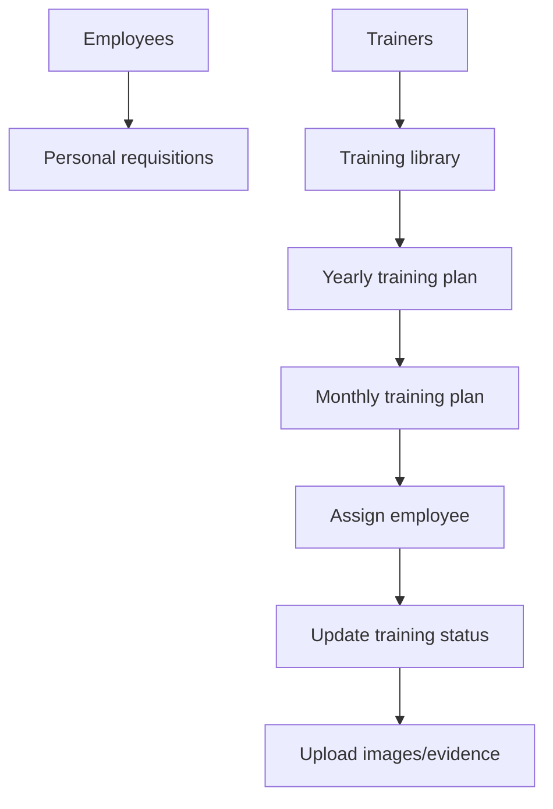
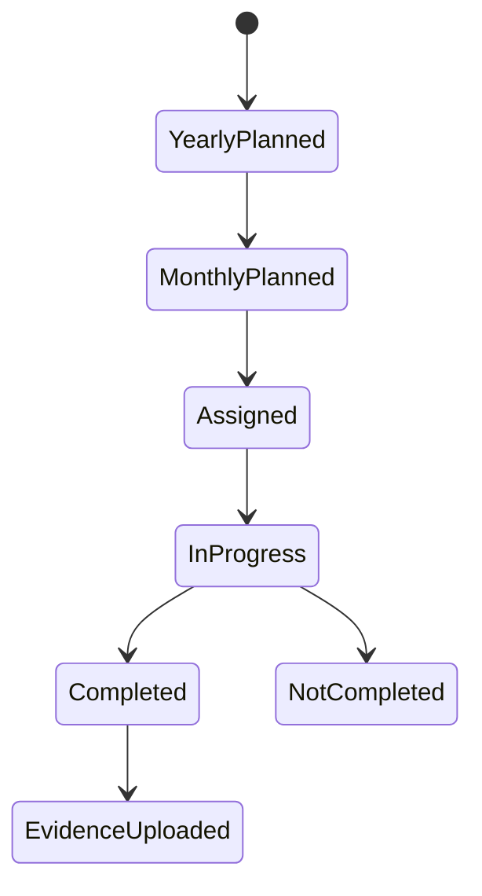

# Competency Management

Competency Management owns employee records, trainer records, training content, yearly/monthly training planning, assignments, evidence, and personal requisitions.

## Flow

## Employee

Routes: `POST /employees`, `GET /employees/all`, `GET /employees/department/:departmentId`, `GET /employees/:id`, `PATCH /employees/:id`, `DELETE /employees/:id`, `DELETE /employees/all`.

Purpose: create and maintain employee records. Service also has company-wide lookup and user-name generation behavior.

## Trainer

Routes: `POST /trainers`, `GET /trainers/:departmentId`, `PATCH /trainers/:id`, `DELETE /trainers/:id`, `DELETE /trainers/all`.

Purpose: create trainer records, process trainer documents/PDFs, and list by company or department.

## Training

Routes: `POST /trainings`, `GET /trainings/:departmentId`, `PATCH /trainings/:id`, `DELETE /trainings/:id`, `DELETE /trainings/all`.

Purpose: create reusable training records and process training material PDFs/files.

## Yearly Training Plan

Routes: `POST /yearly-training-plans`, `GET /yearly-training-plans`, `PATCH /yearly-training-plans/:id`, `DELETE /yearly-training-plans/:id`, `DELETE /yearly-training-plans/all`.

Purpose: plan trainings across the year by month/week. Utility code derives department scope and training-session weeks.

## Monthly Training Plan

Routes: `POST /monthly-training-plans`, `GET /monthly-training-plans`, `PATCH /monthly-training-plans/:id`, `PATCH /monthly-training-plans/assign`, `PATCH /monthly-training-plans/training-status`, `PATCH /monthly-training-plans/images`, `DELETE /monthly-training-plans/:id`, `DELETE /monthly-training-plans/all`.

Purpose:

- Create monthly plans from valid yearly-plan weeks.
- Assign employees.
- Update training status.
- Upload images/evidence for completion.

## Personal Requisition

Routes: `POST /personal-requisitions`, `GET /personal-requisitions/:departmentId`, `GET /personal-requisitions/all/:companyId`, `PATCH /personal-requisitions`, `DELETE /personal-requisitions/:id`, `DELETE /personal-requisitions/all`.

Purpose: create and update personnel requisition status for department/company workforce needs.

## Training Plan State

