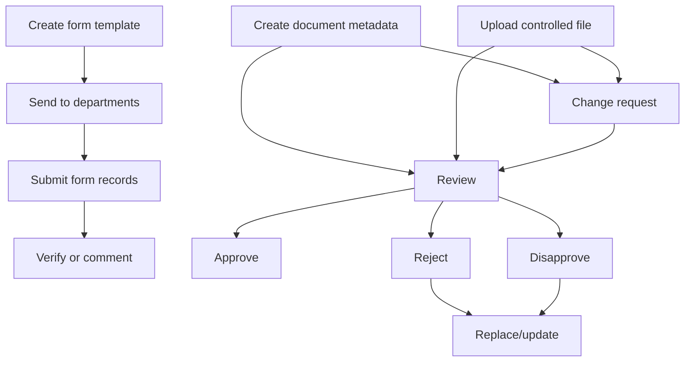
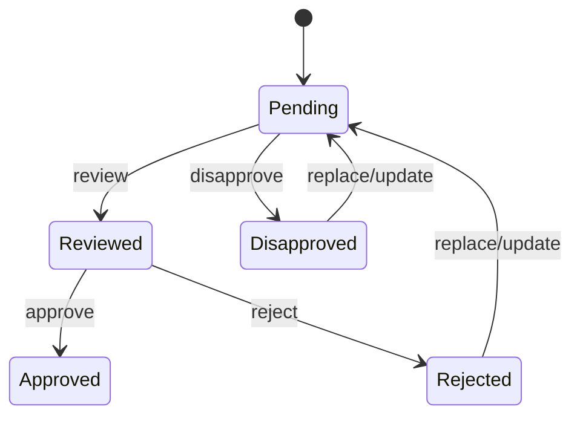

# Document Management

Document Management controls documents, uploaded document revisions, change requests, form templates, and form responses.

## Flow

## Document

Purpose: manage controlled document metadata.

Routes: `POST /documents`, `GET /documents/:departmentId`, `GET /documents/:documentId`, `PUT /documents`, `PATCH /documents/review`, `PATCH /documents/reject`, `PATCH /documents/approve`, `PATCH /documents/disapprove`.

State: `Pending`, `Reviewed`, `Rejected`, `Approved`, `Disapproved`.

Data owned: document ID, department, owning department, category, title, revision, status, review/approval fields, reason/comments.

## Uploaded Documents

Purpose: manage actual uploaded file revisions.

Routes: `POST /upload-documents`, `GET /upload-documents/all/:departmentId`, `GET /upload-documents/:documentId`, `PATCH /upload-documents/review`, `PATCH /upload-documents/reject`, `PATCH /upload-documents/approve`, `PATCH /upload-documents/disapprove`, `PATCH /upload-documents/comment/:documentId`, `PUT /upload-documents/replace/:documentId`.

Behavior:

- Creates and replaces uploaded files.
- Generates first-page/approval PDF pages in service logic.
- Maintains `UploadedDocuments` revision array.
- Replacement is intended for pending/rejected/disapproved records.

## Change Requests

Purpose: request changes against a document or uploaded document.

Routes: `POST /change-requests`, `GET /change-requests/:departmentId`, `GET /change-requests/:requestId`, `GET /change-requests/all/:companyId`, `PATCH /change-requests/review`, `PATCH /change-requests/reject`, `PATCH /change-requests/approve`, `PATCH /change-requests/disapprove`.

Data owned: request ID, department, target type (`Document` or `UploadDocuments`), request details, status, review/approval fields.

## List Of Forms

Purpose: create form templates and distribute them for filling.

Routes: `POST /list-of-forms`, `GET /list-of-forms/:formId`, `GET /list-of-forms/all/:departmentId`, `GET /list-of-forms/to-fill/:departmentId`, `PUT /list-of-forms`, `PUT /list-of-forms/send`, `PATCH /list-of-forms/review`, `PATCH /list-of-forms/reject`, `PATCH /list-of-forms/approve`, `PATCH /list-of-forms/disapprove`.

Data owned: form ID, title, category, questions, selected departments, revision/status metadata.

## Form Records

Purpose: capture and verify submitted answers to forms.

Routes: `POST /form-records/submit-response`, `PATCH /form-records/addComment`, `PATCH /form-records/verify-response`, `GET /form-records/get-responses-by-formId/:formId/:departmentId`, `GET /form-records/get-record-by-recordId/:recordId`.

State: `Pending`, `Verified`, `Rejected`.

## Document Approval Sequence

