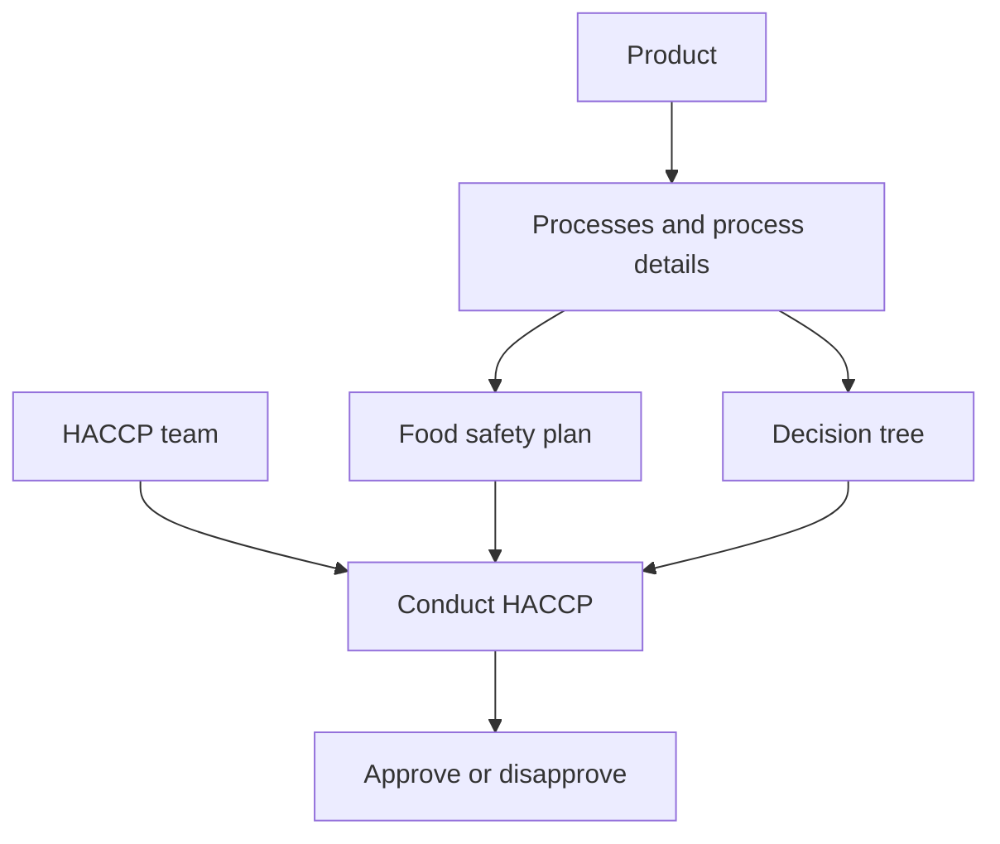
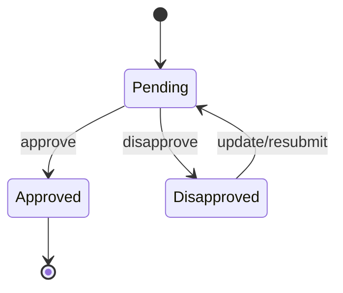

# Food Safety

Food Safety covers product definitions, HACCP teams, process flows, plans, decision trees, and HACCP execution.

## End-To-End Flow

## Product

Routes: `POST /product`, `GET /product/all/:departmentId`, `GET /product/:productId`, `PATCH /product/:productId`, `PATCH /product/approve`, `PATCH /product/disapprove`, `DELETE /product/:productId`, `DELETE /product/all`.

Purpose: store product and product-detail data needed by HACCP planning.

State: `Pending`, `Approved`, `Disapproved`.

## HACCP Team

Routes: `POST /haccp-team`, `GET /haccp-team/all/:departmentId`, `GET /haccp-team/approved/:departmentId`, `GET /haccp-team/:teamId`, `PATCH /haccp-team/approve`, `PATCH /haccp-team/disapprove`, `DELETE /haccp-team/:teamId`, `DELETE /haccp-team/all`.

Purpose: define team and members responsible for HACCP work. The service can process PDF content with watermark/first-page behavior.

## Processes

Routes: `POST /processes`, `GET /processes/all/:departmentId`, `GET /processes/approved/:departmentId`, `GET /processes/:processId`, `GET /processes/detail/:processId`, `PATCH /processes/:processId`, `PATCH /processes/approve`, `PATCH /processes/disapprove`, `DELETE /processes`, `DELETE /processes/all`.

Purpose: define process flow and process details used by food safety plan, decision tree, and HACCP.

## Food Safety Plan

Routes: `POST /food-safety`, `GET /food-safety/all/:departmentId`, `GET /food-safety/:planId`, `PATCH /food-safety/:planId`, `PATCH /food-safety/approve`, `PATCH /food-safety/disapprove`, `DELETE /food-safety`, `DELETE /food-safety/all`.

Purpose: create a food safety plan with plan entries and approval metadata.

## Decision Tree

Routes: `POST /decision-tree`, `GET /decision-tree/all/:departmentId`, `GET /decision-tree/approved/:departmentId`, `GET /decision-tree/:treeId`, `PATCH /decision-tree/:treeId`, `PATCH /decision-tree/approve`, `PATCH /decision-tree/disapprove`, `DELETE /decision-tree`, `DELETE /decision-tree/all`.

Purpose: store decision records that support CCP/OPRP style hazard decisions.

## Conduct HACCP

Routes: `POST /conduct-haccp`, `GET /conduct-haccp/all/:departmentId`, `GET /conduct-haccp/approved/:departmentId`, `GET /conduct-haccp/:haccpId`, `PUT /conduct-haccp/:haccpId`, `PATCH /conduct-haccp/approve`, `PATCH /conduct-haccp/disapprove`, `DELETE /conduct-haccp`, `DELETE /conduct-haccp/all`.

Purpose: perform hazard analysis against processes, HACCP teams, and hazards. Hazard records include type, description, likelihood/severity style scoring, and controls.

## Approval Pattern

