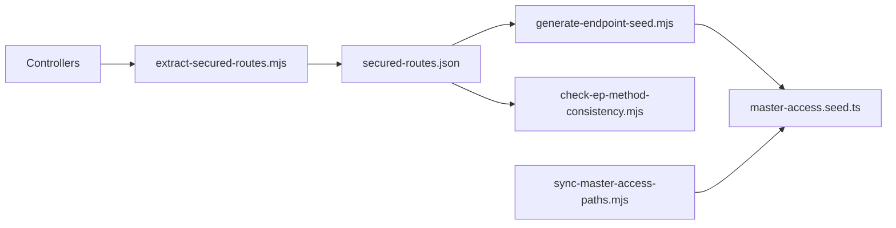

# Integrations And Supporting Services

## Swagger

`main.ts` creates Swagger documentation with:

- Title: `Food Safety Quality API`
- Version: `1.0`
- Bearer auth enabled
- UI path: `/api`

## Validation And CORS

The app enables CORS for browser clients and uses a global `ValidationPipe`:

- `transform: true`
- `whitelist: true`
- `enableImplicitConversion: true`

## MongoDB

`AppModule` connects with `MongooseModule.forRootAsync` using `process.env.MONGODB_URI`.

Every business module registers its own schemas with `MongooseModule.forFeature`.

## Cloudinary

Cloudinary support appears in two places:

- `src/cloudinary/cloudinary.service.ts` and `cloudinary-upload.controller.ts`
- `src/services/cloudinary.service.ts`

Routes:

| Method | Path | Purpose |
| --- | --- | --- |
| `POST` | `/upload/cloudinary` | Upload file to Cloudinary. |
| `POST` | `/upload/cloudinary/delete` | Delete Cloudinary file by URL/public ID behavior. |

## Email

`EmailService` sends:

- Registration emails.
- Trainer registration emails.
- Generic notification emails.
- MRM emails.
- Plain subject/text emails.

Templates live in `src/email/templates`:

- `registrationConfirmation.ejs`
- `notificationEmail.ejs`
- `mrmEmailTemplate.ejs`

## PDF/File Processing

Several services process PDFs or generate cover/approval pages before storing records:

| Area | Examples |
| --- | --- |
| Document Management | Uploaded documents add first/approval pages. |
| Competency Management | Trainer documents and training material processing. |
| Food Safety | HACCP team PDF watermark/first-page behavior. |
| Internal Audit | Auditor, conduct audit, corrective action PDF handling. |
| Maintenance | Calibration record PDF handling. |

## Local Scripts

Supporting script files:

- `scripts/extract-secured-routes.mjs`
- `scripts/secured-routes.json`
- `scripts/generate-endpoint-seed.mjs`
- `scripts/sync-master-access-paths.mjs`
- `scripts/check-ep-method-consistency.mjs`
- `scripts/list-resource-group-keys.mjs`

