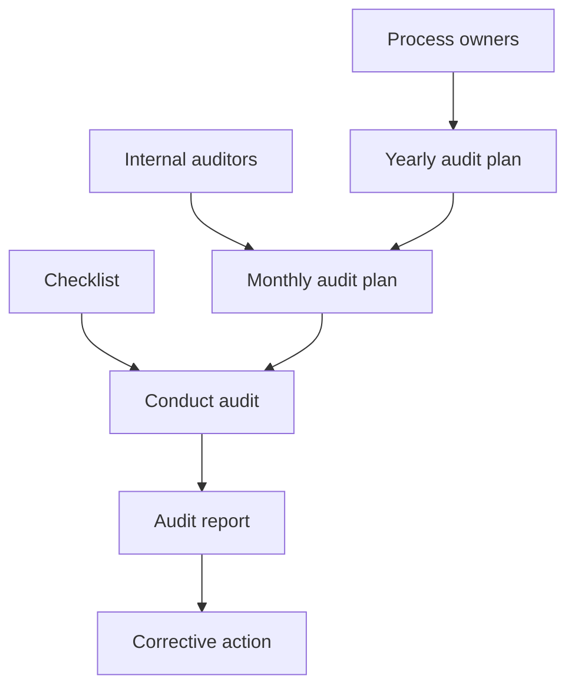
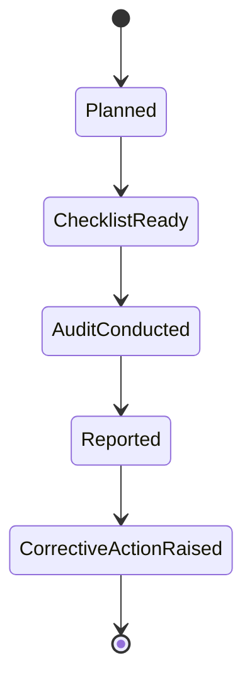

# Internal Audit

Internal Audit covers process owners, auditors, audit plans, checklist preparation, audit execution, reporting, and corrective actions.

## Flow

## Process Owner

Routes: `POST /process-owner`, `GET /process-owner/all/:departmentId`, `DELETE /process-owner/:processId`, `DELETE /process-owner/all`.

Purpose: define process responsibility and profile-backed owner details.

## Internal Auditor

Routes: `POST /internal-auditor`, `GET /internal-auditor/all/:departmentId`, `DELETE /internal-auditor`, `DELETE /internal-auditor/all`.

Purpose: register auditors and associated documents. Service logic can process PDFs with watermark/first-page behavior.

## Yearly Auditing Plan

Routes: `POST /yearly-audit-plan`, `GET /yearly-audit-plan/all/:departmentId`, `GET /yearly-audit-plan/:planId`, `PUT /yearly-audit-plan/:planId`, `DELETE /yearly-audit-plan/:planId`, `DELETE /yearly-audit-plan/all`.

Purpose: create an annual audit schedule, including selected process owners and planned months.

## Monthly Auditing Plan

Routes: `POST /monthly-audit-plan`, `GET /monthly-audit-plan/:departmentId`, `GET /monthly-audit-plan/:planId`, `DELETE /monthly-audit-plan`.

Purpose: convert yearly planning into concrete monthly audit plan records.

## Checklist

Routes: `POST /checklist`, `GET /checklist/all/:departmentId`, `GET /checklist/:checklistId`, `PUT /checklist`, `PATCH /checklist/approve`, `PATCH /checklist/disapprove`, `DELETE /checklist`, `DELETE /checklist/all`.

Purpose: create checklist questions and approve/disapprove checklist records before audit use.

## Conduct Audits

Routes: `POST /conduct-audits`, `GET /conduct-audits/all/:departmentId`, `GET /conduct-audits/by-checklist/:checklistId/:departmentId`, `GET /conduct-audits/by-audit/:auditId`, `DELETE /conduct-audits`, `DELETE /conduct-audits/all`.

Purpose: capture audit answers/evidence against a checklist. Service logic includes PDF processing/watermark behavior.

## Reports

Routes: `POST /reports`, `GET /reports/all/:departmentId`, `GET /reports/:reportId`, `GET /reports/by-audit/:auditId/:departmentId`, `DELETE /reports`, `DELETE /reports/all`.

Purpose: generate audit reports from conducted audit answers.

## Corrective Action

Routes: `POST /corrective-action`, `GET /corrective-action/by-report/:reportId/:departmentId`, `GET /corrective-action/by-action/:actionId`, `DELETE /corrective-action`, `DELETE /corrective-action/all`.

Purpose: record corrective actions raised from audit reports.

## Audit Lifecycle

