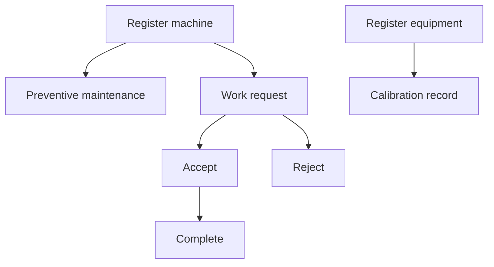
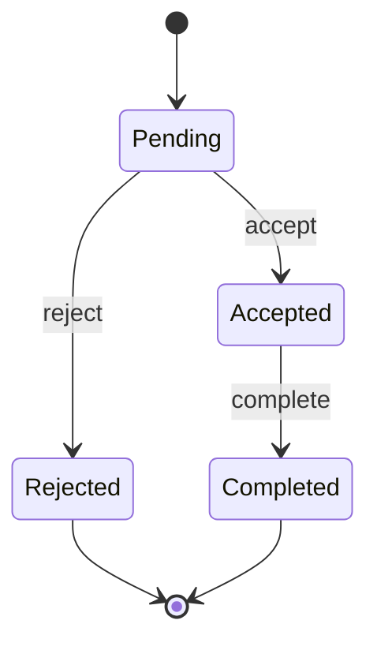

# Maintenance Program

Maintenance Program owns machine and equipment assets, preventive maintenance, calibration, and work request lifecycle.

## Flow

## Machinery

Routes: `POST /machines`, `GET /machines/all/:departmentId`, `GET /machines/:id`, `DELETE /machines/:id`, `DELETE /machines/all`.

Purpose: register machinery assets scoped to a department.

## Equipment

Routes: `POST /equipments`, `GET /equipments/all/:departmentId`, `GET /equipments/:id`, `DELETE /equipments/:id`, `DELETE /equipments/all`.

Purpose: register equipment assets. Equipment is used by calibration records.

## Calibration Record

Routes: `POST /calibration-record/:equipmentId`, `GET /calibration-record/all/:departmentId`, `GET /calibration-record/by-equipment/:equipmentId/:departmentId`.

Purpose: record internal/external calibration events for equipment. Service can process PDF input.

## Preventive Maintenance

Routes: `POST /preventive-maintenance/:machineId`, `GET /preventive-maintenance/all/:departmentId`, `GET /preventive-maintenance/by-machine/:machineId/:departmentId`, `GET /preventive-maintenance/:id`, `DELETE /preventive-maintenance/:id`, `DELETE /preventive-maintenance/all`.

Purpose: record scheduled/preventive maintenance activity against machines.

## Work Request

Routes: `POST /work-requests`, `GET /work-requests/all/:departmentId`, `GET /work-requests/by-machine/:machineId/:departmentId`, `GET /work-requests/:id`, `PATCH /work-requests/:id/accept`, `PATCH /work-requests/:id/reject`, `PATCH /work-requests/:id/complete`, `DELETE /work-requests/:id`, `DELETE /work-requests/all`.

Purpose: request maintenance work, then accept, reject, or complete it.

## Work Request State

