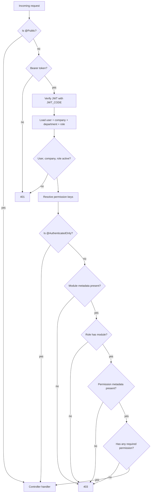
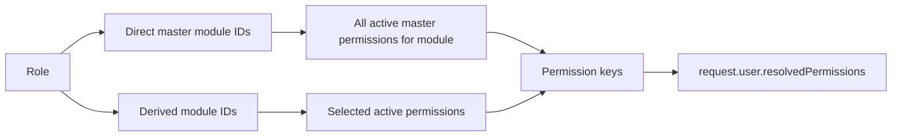

# Permission Logic Implementation

## Guard Chain

The application registers these guards globally in `AppModule`:

1. `JwtAuthGuard`
2. `ModuleAccessGuard`
3. `PermissionGuard`

## Public And Auth-Only Endpoints

- `@Public()` skips all authentication and authorization guards.
- `@AuthenticatedOnly()` requires a valid JWT but skips module and endpoint permission checks.
- Login and super-admin bootstrap endpoints are public-style entry points.

## JWT Authentication

`JwtAuthGuard`:

- Extracts `Authorization: Bearer <token>`.
- Verifies the token with `process.env.JWT_CODE`.
- Reads `payload.userId` or `payload.id`.
- Loads the user with populated `departmentId`, `companyId`, and `roleId`.
- Rejects suspended users, inactive companies, and inactive roles.
- Computes `request.user.resolvedPermissions`.

## Permission Resolution

Rules:

- A `SUPER_ADMIN` role resolves to `['*']`.
- Direct module assignment grants all active permissions under those master modules.
- Derived modules grant only the selected permissions configured for that derived module.
- `PermissionGuard` accepts access when any required permission key is present.

## Module Access

`ModuleAccessGuard` checks `@ModuleAccess(...)` metadata. `@SecuredEndpoint(moduleKey, permissionKey)` is the common controller decorator that supplies both module and permission metadata.

Module access is granted when:

- The user is super admin, or
- The role has a direct master module with the requested key, or
- The role has an active derived module whose `masterModuleId.key` matches the requested module key.

## Endpoint Permission Inventory

Secured endpoints are generated into `scripts/secured-routes.json`. Current counts by module:

| Module key | Secured endpoints |
| --- | ---: |
| ADMIN_MANAGEMENT | 27 |
| RBAC | 14 |
| DOCUMENT_MANAGEMENT | 40 |
| FOOD_SAFETY | 52 |
| INTERNAL_AUDIT | 43 |
| COMPETENCY_MANAGEMENT | 36 |
| MAINTENANCE_PROGRAM | 28 |
| SUPPLIER_MANAGEMENT | 7 |
| REVIEW_MEETINGS | 16 |

## Operational Notes

- Every protected endpoint should have explicit secured metadata. Missing metadata causes `403`.
- Route keys in code should remain synchronized with `master-access.seed.ts` and `scripts/secured-routes.json`.
- Company admin access should remain company-scoped; department-level workflows should continue checking `departmentId`.

