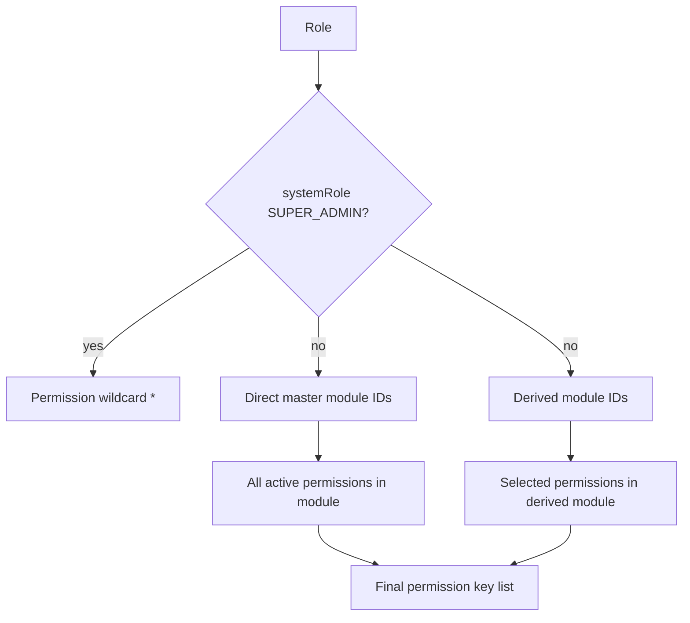
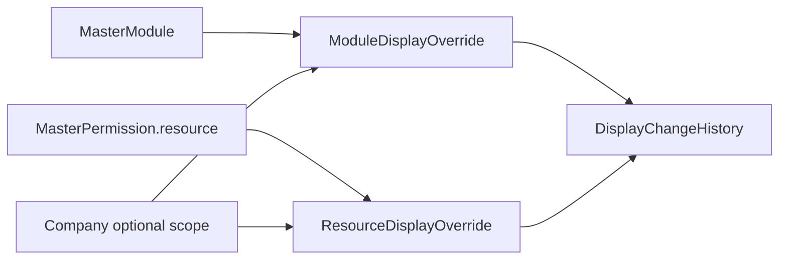

# RBAC And Auth

RBAC controls master modules, master permissions, derived modules, roles, and assignment. Auth guards enforce those records on each secured route.

## Core Records

| Record | Purpose |
| --- | --- |
| `MasterModule` | Global module catalog such as `FOOD_SAFETY` or `DOCUMENT_MANAGEMENT`. |
| `MasterPermission` | Endpoint/resource/action permission key under a module. |
| `DerivedModule` | Company-specific subset of permissions from a master module. |
| `Role` | Access bundle containing direct master modules and/or derived modules. |
| `User.roleId` | User access entry point. |

## RBAC Routes

| Method | Path | Purpose |
| --- | --- | --- |
| `POST` | `/rbac/seed-master-data` | Seed master modules and permissions. |
| `POST` | `/rbac/roles/super-admin` | Create super-admin role. |
| `GET` | `/rbac/master-modules` | List master modules. |
| `GET` | `/rbac/master-modules/:masterModuleId/details` | Read module with details. |
| `GET` | `/rbac/master-resources` | Group resources by module. |
| `GET` | `/rbac/master-permissions` | List master permissions. |
| `GET` | `/rbac/master-permissions/module/:moduleId` | Permissions by module. |
| `GET` | `/rbac/permission-tree` | Complete permission tree. |
| `POST` | `/rbac/derived-modules` | Create company-specific module subset. |
| `GET` | `/rbac/derived-modules` | List derived modules. |
| `GET` | `/rbac/derived-modules/:derivedModuleId` | Read derived module. |
| `PATCH` | `/rbac/derived-modules/:derivedModuleId` | Update derived module. |
| `DELETE` | `/rbac/derived-modules/:derivedModuleId` | Delete/deactivate derived module. |
| `POST` | `/rbac/roles` | Create role. |
| `GET` | `/rbac/roles` | List roles. |
| `PATCH` | `/rbac/assign-role` | Assign role to user. |

## Access Resolution



## Secured Endpoint Pattern

Controllers generally use:

```ts
@SecuredEndpoint('MODULE_KEY', 'EP_PERMISSION_KEY')
```

That metadata supplies both:

- Required module key for `ModuleAccessGuard`.
- Required permission key for `PermissionGuard`.

## Scripts

| Script | Purpose |
| --- | --- |
| `extract-secured-routes.mjs` | Scan controllers and build secured endpoint inventory. |
| `generate-endpoint-seed.mjs` | Generate endpoint seed-style data. |
| `sync-master-access-paths.mjs` | Keep master access paths aligned with controllers. |
| `check-ep-method-consistency.mjs` | Validate endpoint key/method consistency. |
| `list-resource-group-keys.mjs` | List resource grouping keys. |

## Backend Gap For Super Admin Runtime Renaming

The frontend requirements include runtime renaming/grouping of modules and parent-child groups, global or per-company overrides, and timeline history. Current backend RBAC supports seeded master modules, seeded permissions, derived modules, roles, and assignments. It does not yet expose persistence for:

- Module display-name overrides.
- Resource/sub-tab display-name overrides outside `DerivedModule.resourceCustomNames`.
- Parent-child group reorganization.
- Global vs company-specific naming policies.
- Change history/timeline records.

Recommended backend addition:



Until those endpoints exist, the frontend should treat seeded module names and permission groups as read-only, while still allowing role and derived-module creation from the existing RBAC endpoints.
