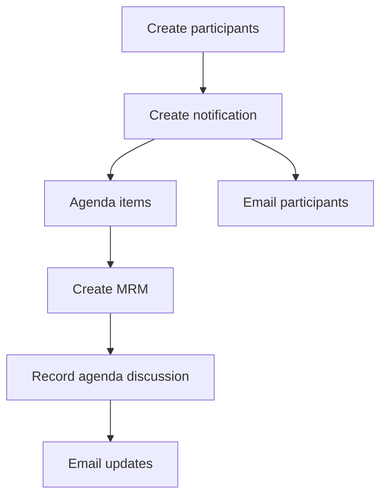
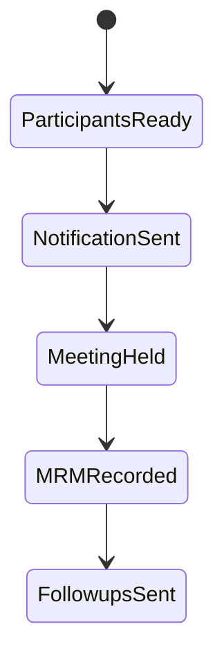

# Review Meetings

Review Meetings owns meeting participants, meeting notifications, agenda items, and management review meeting records.

## Flow

## Meeting Participants

Routes: `POST /meeting-participants`, `GET /meeting-participants`, `GET /meeting-participants/all/:departmentId`, `GET /meeting-participants/:id`, `PUT /meeting-participants/:id`, `DELETE /meeting-participants`, `DELETE /meeting-participants/all`.

Purpose: create participants, generate usernames where needed, maintain profile-backed attendee records, and list by department/company.

## Notification

Routes: `POST /notification`, `GET /notification/all/:departmentId`, `GET /notification/:id`, `DELETE /notification`, `DELETE /notification/all`.

Purpose: create meeting notifications with agenda items and participant references. The service sends email to participant addresses.

Data owned: department, title/details, agendas, date/time/location, participants, created/updated metadata.

## MRM

Routes: `POST /mrm`, `GET /mrm/all/:departmentId`, `GET /mrm/:id`, `DELETE /mrm`, `DELETE /mrm/all`.

Purpose: record management review meeting outcomes and agenda discussion details. The service can email participants about discussion updates.

## Meeting Lifecycle

