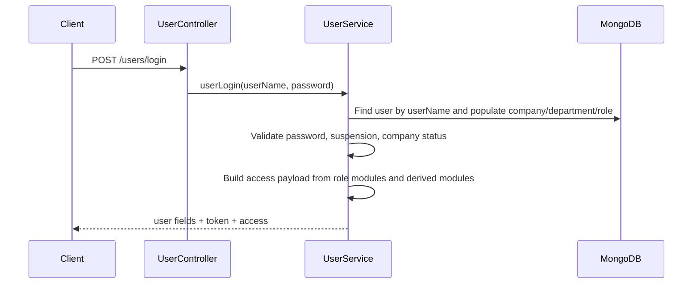
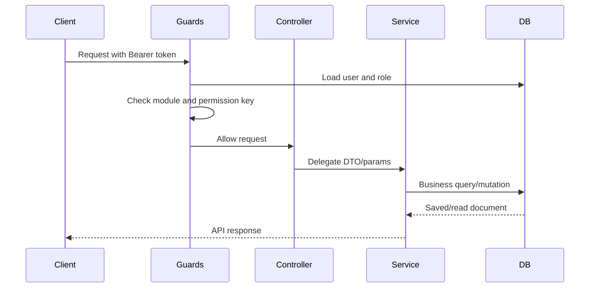
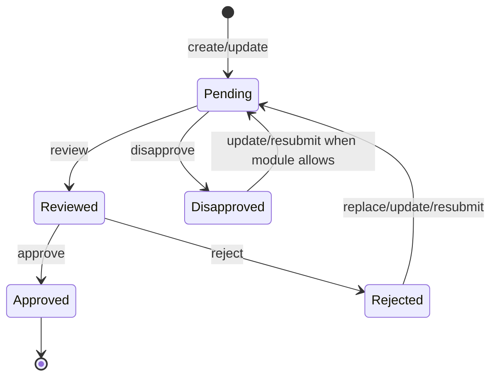
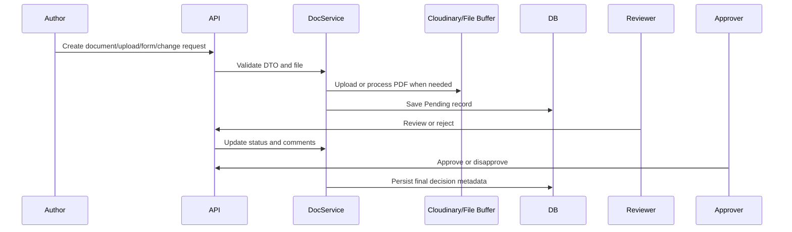
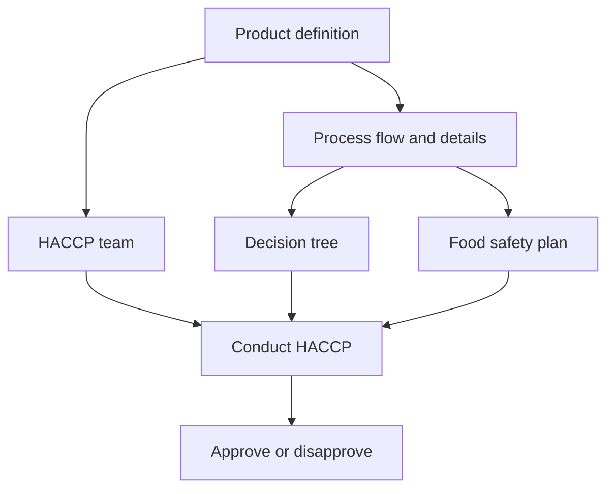
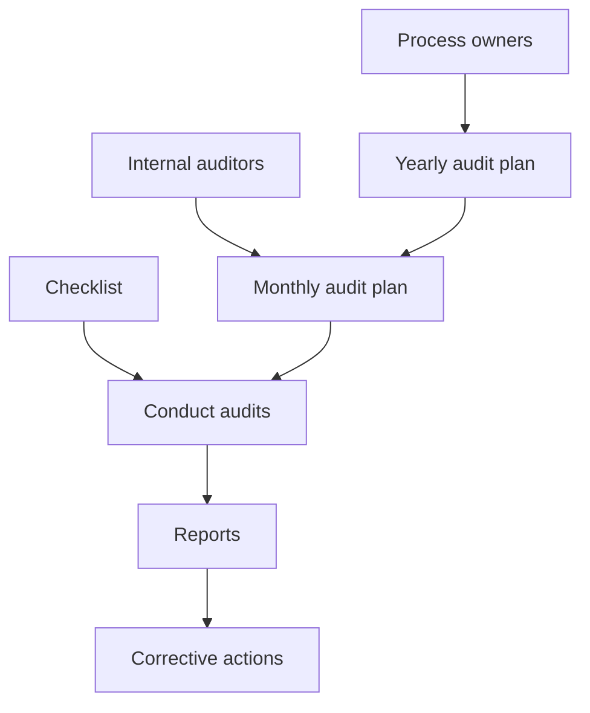
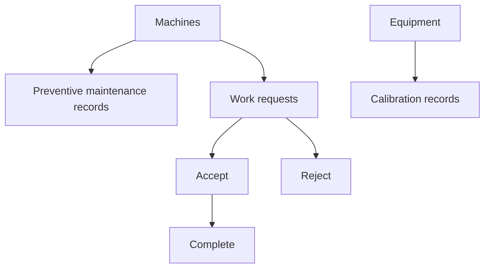
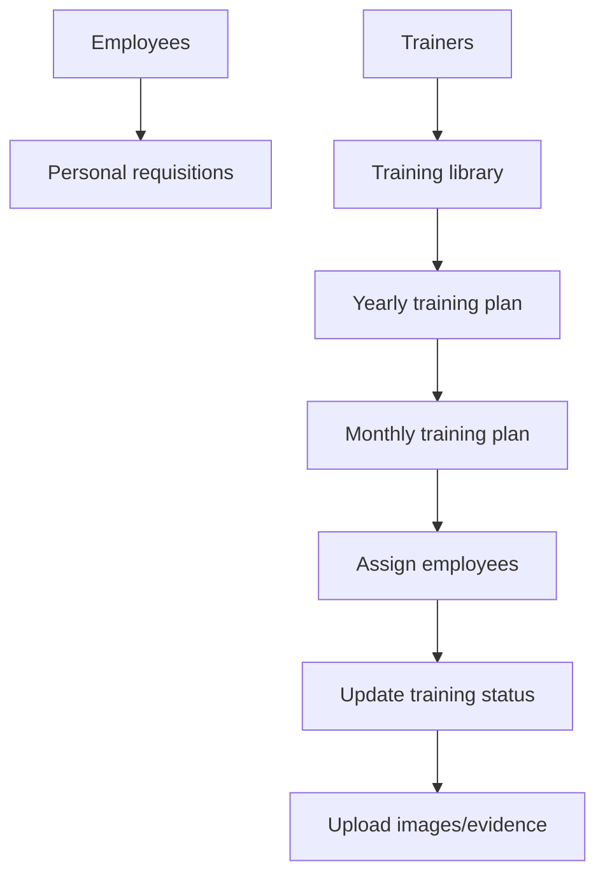
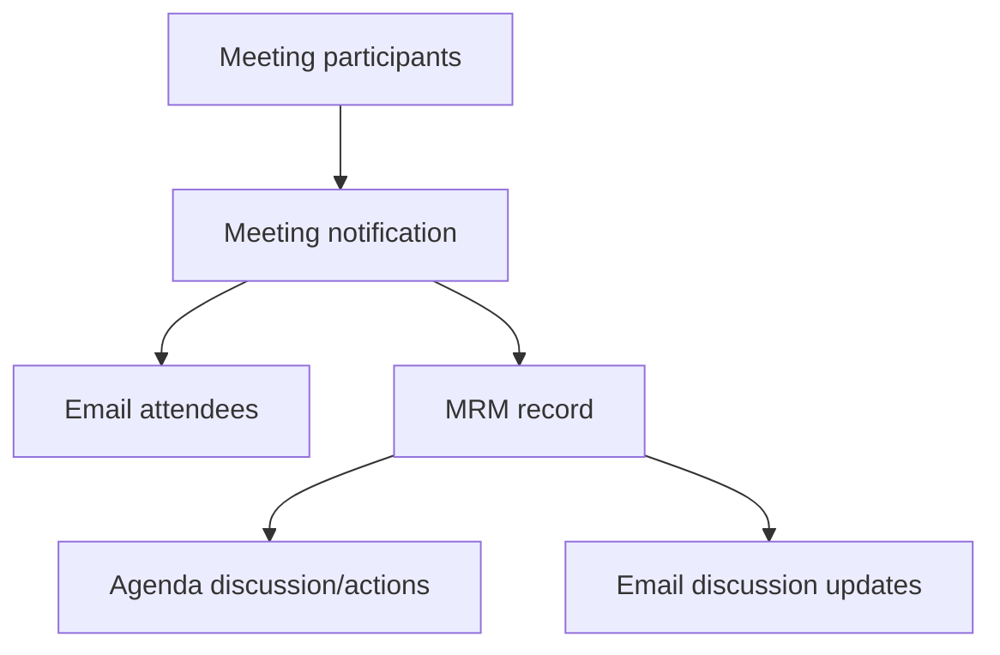

# Sequence Diagrams

## Login And Access Payload

## Protected Endpoint

## Generic Approval Workflow

Used by documents, uploaded documents, forms, change requests, food safety records, HACCP records, checklist records, suppliers, and related approval-capable modules. Some modules use a simpler `Pending -> Approved/Disapproved` flow.

## Document Control

## Food Safety HACCP

## Internal Audit

## Maintenance

## Competency Management

## Review Meetings

