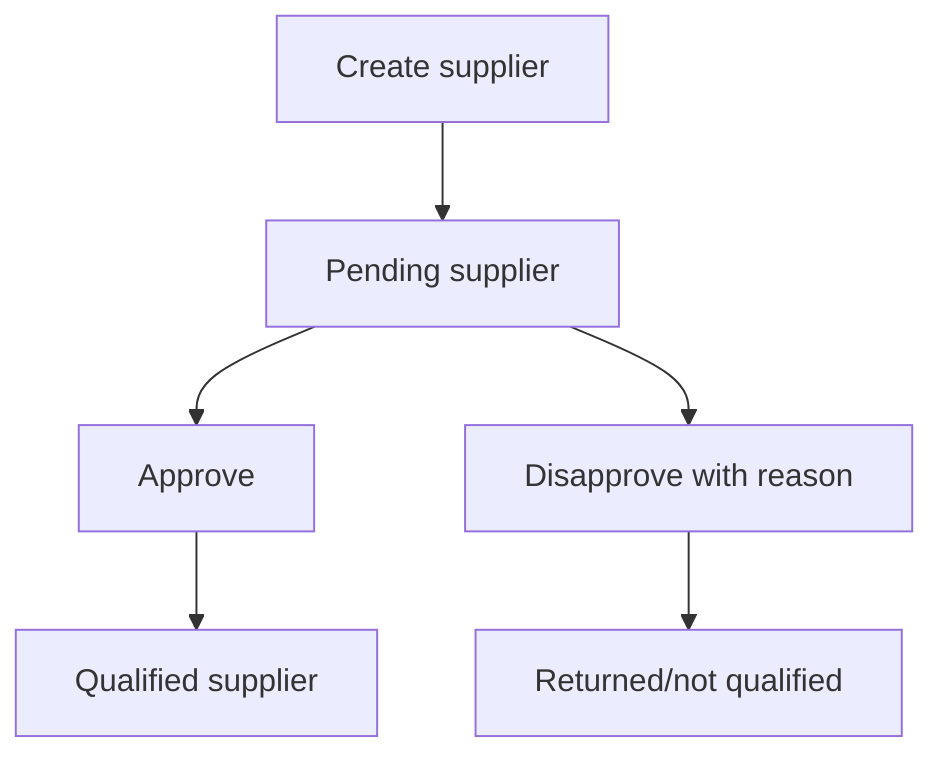

# Supplier Management

Supplier Management owns supplier records and their approval lifecycle.

## Flow

## Supplier

Routes:

| Method | Path | Purpose |
| --- | --- | --- |
| `POST` | `/suppliers` | Create supplier. |
| `GET` | `/suppliers/all/:departmentId` | List suppliers by department. |
| `GET` | `/suppliers/:id` | Read supplier. |
| `PATCH` | `/suppliers/approve` | Approve supplier. |
| `PATCH` | `/suppliers/disapprove` | Disapprove supplier. |
| `DELETE` | `/suppliers` | Delete supplier. |
| `DELETE` | `/suppliers/all` | Delete all suppliers. |

Data owned: supplier identity, linked user/profile behavior, department, company context, approval status, approver/disapprover metadata.

Important behavior:

- Creation checks user email uniqueness.
- Creation and deletion run through profile transaction behavior.
- Approved suppliers cannot be disapproved again by current service rules.

